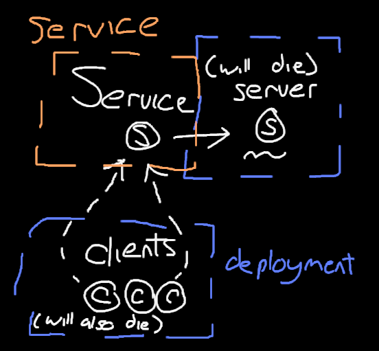

# Server -> Client Kubernetes Configuration

This project is a small endeavour into kubernetes configuration, at getting a server setup that clients can connect and make requests too.

Much of the thanks belongs to [this article](https://medium.com/google-cloud/understanding-kubernetes-networking-pods-7117dd28727), for
helping outline the fundumental concepts of Kubernetes. In addition, Kubernetes documentation was useful [for services](https://kubernetes.io/docs/concepts/services-networking/connect-applications-service/#creating-a-service)
and for [creating deployments](https://kubernetes.io/docs/concepts/workloads/controllers/deployment/#creating-a-deployment).

The way this project is architected is as follows:

Ephemeral clients are deployed, which will contact the service `http://kubeserver` which will get transformed by CoreDNS (kubernetes DNS server) into the IP address of the pod on the server, which the clients then connect to.

This project has a setup script (`start.sh`) which _should_ work out of the box and deploy the setup, but it may need some tweaking. It should be a good start though, if you're struggling like I was.
